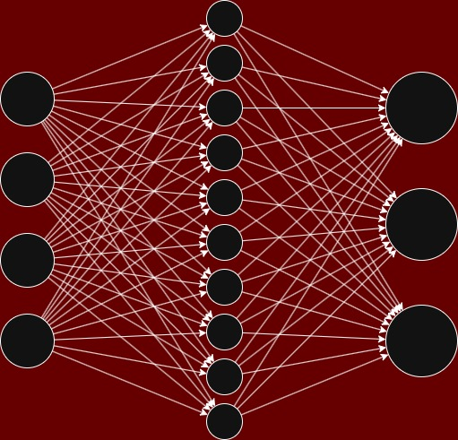

# Neural Network from Scratch (NumPy)

This project implements a simple feedforward neural network **from scratch using only NumPy**, without any deep learning frameworks such as TensorFlow or PyTorch.

The main goal of this project is to understand what happens under the hood in modern deep learning frameworks. Instead of treating neural networks as a “black box”, this project focuses on the core mathematical components behind them.

The implementation is explained in three main parts:

- Forward propagation  
- Backpropagation  
- Gradient-based optimization  

## Forward propagation

Before diving into the full implementation of the forward pass, we need to cover the essential building blocks. This section explains the data preprocessing and the activation functions that make the network work.

### Data preparation

```python
def load_data():
    iris = datasets.load_iris()
    X = iris.data
    y = iris.target

    # normalization
    X = (X - np.mean(X, axis=0)) / np.std(X, axis=0)

    # one-hot encoding
    Y = np.eye(3)[y]

    # shuffle
    indices = np.arange(len(X))
    np.random.shuffle(indices)

    X, Y = X[indices], Y[indices]

    # split
    split_idx = int(len(X) * 0.8)
    X_train, X_test = X[:split_idx], X[split_idx:]
    Y_train, Y_test = Y[:split_idx], Y[split_idx:]

    return X_train, X_test, Y_train, Y_test
```

To implement forward propagation, the data must first be preprocessed. The following steps are performed in the load_data function:

- [Normalization](https://www.datacamp.com/tutorial/normalization-in-machine-learning): The input features are standardized to have a mean of 0 and a standard deviation of 1. This ensures a smoother loss surface, which allows the model to converge faster and more efficiently.
- [One-Hot Encoding](https://www.geeksforgeeks.org/machine-learning/ml-one-hot-encoding/): Target labels are converted from scalars to one-hot encoded vectors. This representation is essential for calculating the loss and gradients during the backpropagation phase.
- Shuffling: Since the Iris dataset is sorted by class, the data is shuffled to prevent class imbalance in the training and testing sets.
- Data Splitting: The dataset is split into a training set (80% / 120 samples) and a testing set (20% / 30 samples) to evaluate the model's generalization performance.
  
---

### Model Architecture

Based on the dataset:

- Input layer: 4 neurons (one per feature)  
- Hidden layer: 10 neurons  
- Output layer: 3 neurons (one per class)

<p align="center">
  
</p>

---

### Weight Initialization

Before performing forward propagation, we need to initialize the model parameters (weights and biases). 

These parameters are the “brain” of the model — they determine how input data is transformed into predictions.

Weights are initialized randomly, but not purely random.  
We use [**He initialization**](https://medium.com/@piyushkashyap045/mastering-weight-initialization-in-neural-networks-a-beginners-guide-6066403140e9), which helps stabilize training and improves convergence during gradient-based optimization.

```python
self.W1 = np.random.randn(input_dim, h_dim) * np.sqrt(2 / input_dim)
self.B1 = np.zeros((1, h_dim))

self.W2 = np.random.randn(h_dim, out_dim) * np.sqrt(2 / h_dim)
self.B2 = np.zeros((1, out_dim))
```
To better understand the implementation, let's rewrite the model in mathematical form using matrices.

Neural networks rely heavily on matrix operations, which allow us to compute many operations in parallel.  
This is one of the key reasons why neural networks are efficient and scalable.

For now, let's define the shapes of our parameters:

- W₁ ∈ ℝ^(4 × 10)  
- B₁ ∈ ℝ^(1 × 10)  
- W₂ ∈ ℝ^(10 × 3)  
- B₂ ∈ ℝ^(1 × 3)  

Below is how these parameters look in matrix form:

$$
W_1 =
\begin{bmatrix}
w^{(1)}_{11} & w^{(1)}_{12} & w^{(1)}_{13} & \cdots & w^{(1)}_{1,10} \\
w^{(1)}_{21} & w^{(1)}_{22} & w^{(1)}_{23} & \cdots & w^{(1)}_{2,10} \\
w^{(1)}_{31} & w^{(1)}_{32} & w^{(1)}_{33} & \cdots & w^{(1)}_{3,10} \\
w^{(1)}_{41} & w^{(1)}_{42} & w^{(1)}_{43} & \cdots & w^{(1)}_{4,10}
\end{bmatrix}
\quad
B_1 =
\begin{bmatrix}
b^{(1)}_1 & b^{(1)}_2 & b^{(1)}_3 & \cdots & b^{(1)}_{10}
\end{bmatrix}
$$

$$
W_2 =
\begin{bmatrix}
w^{(2)}_{11} & w^{(2)}_{12} & w^{(2)}_{13} \\
w^{(2)}_{21} & w^{(2)}_{22} & w^{(2)}_{23} \\
\vdots & \vdots & \vdots \\
w^{(2)}_{10,1} & w^{(2)}_{10,2} & w^{(2)}_{10,3}
\end{bmatrix}
\quad
B_2 =
\begin{bmatrix}
b^{(2)}_1 & b^{(2)}_2 & b^{(2)}_3
\end{bmatrix}
$$

---

### ReLU Activation Function

```python
def relu(self, x):
        return np.maximum(0, x)
```
<p align="center">
  
</p>

ReLU sets negative values to zero and introduces non-linearity.  
Without activation functions, a neural network would behave like a linear model.  
This allows the model to learn complex patterns and helps reduce the vanishing gradient problem.

---

### Softmax Activation Function

The final layer of our network produces raw scores called **logits** ($\mathbf{A_2}$). However, these scores can be any real number, making them difficult to use for classification. To solve this, we use the **Softmax** activation function.

Softmax transforms these logits into a probability distribution where:
1. Each value is between **0 and 1**.
2. The sum of all output values is exactly **1**.

This allows us to interpret the output as the model's confidence in each class and is a requirement for calculating the **Cross-Entropy Loss**. The standard mathematical formula is:

$$z_i = \frac{e^{z_i}}{\sum_{j=1} e^{z_j}}$$

In practice, calculating $e^{z_i}$ can be dangerous. If a logit $z_i$ is a large number (e.g., 500), $e^{500}$ will result in an **overflow** (it becomes `inf` in Python), which crashes the model.

To prevent this, we use a technique called **Numerical Stability**. We subtract the maximum value of the input vector from all elements before computing the exponential:

$$z_i = \frac{e^{z_i - \max(\mathbf{z})}}{\sum_{j=1} e^{z_j - \max(\mathbf{z})}}$$

```python
def softmax(x):
    exps = np.exp(x - np.max(x, axis=1, keepdims=True))
    return exps / np.sum(exps, axis=1, keepdims=True)
```

Softmax is **shift-invariant**. This means that adding or subtracting a constant from all inputs does not change the final output probability. Mathematically:
$$\text{Softmax}(x) = \text{Softmax}(x - C)$$

By setting $C = \max(\mathbf{a})$, the largest value in the vector becomes $0$ ($e^0 = 1$), and all other values become negative. This ensures that the values never explode, keeping the calculations stable while preserving the original probability distribution.

---

### Forward pass

Now that we have defined the data and activation functions, we can implement the forward propagation.

```python
def forward(self, X):
        self.A1 = X @ self.W1 + self.B1
        self.H1 = self.relu(self.A1)

        self.A2 = self.H1 @ self.W2 + self.B2
        self.Z = self.softmax(self.A2)

        return self.Z
```


To better understand the forward pass, consider a single input vector:

$$
X = [x_1, x_2, x_3, x_4]
$$

This represents one observation.

Now, consider a single neuron in the hidden layer.  
This neuron is connected to all input features through a set of weights:

$$[w_{11}^{(1)}, w_{21}^{(1)}, w_{31}^{(1)}, w_{41}^{(1)}]$$

The neuron computes a weighted sum of the inputs:

$$a^{(1)}_1 = (x_1 \cdot w_{11}^{(1)} + x_2 \cdot w_{21}^{(1)} + x_3 \cdot w_{31}^{(1)} + x_4 \cdot w_{41}^{(1)}) + b_1^{(1)}$$

Here, \( b \) is the bias term.

The same operation is applied to all neurons in the hidden layer.

The calculation of the vector $\mathbf{A_1}$ can be represented as a matrix operation:

$$\mathbf{A_1} = \begin{bmatrix} x_1 & x_2 & x_3 & x_4 \end{bmatrix} \cdot 
\begin{bmatrix}
w^{(1)}_{11} & w^{(1)}_{12} & w^{(1)}_{13} & \cdots & w^{(1)}_{1,10} \\
w^{(1)}_{21} & w^{(1)}_{22} & w^{(1)}_{23} & \cdots & w^{(1)}_{2,10} \\
w^{(1)}_{31} & w^{(1)}_{32} & w^{(1)}_{33} & \cdots & w^{(1)}_{3,10} \\
w^{(1)}_{41} & w^{(1)}_{42} & w^{(1)}_{43} & \cdots & w^{(1)}_{4,10}
\end{bmatrix} 
+ 
\begin{bmatrix}
b^{(1)}_1 & b^{(1)}_2 & b^{(1)}_3 & \cdots & b^{(1)}_{10}
\end{bmatrix}$$

**Where:**
- $\mathbf{X} = [x_1, x_2, x_3, x_4]$ is the **input vector** (1 $\times$ 4).
- $\mathbf{W_1}$ is the **weight matrix** (4 $\times$ 10), where each column represents the weights for a single neuron.
- $\mathbf{B_1}$ is the **bias vector** (1 $\times$ 10), adding a trainable offset to each neuron.

This mathematical operation is exactly what is implemented in the code as:
`self.A1 = X @ self.W1 + self.B1`

More generally, for any neuron $j$ in the hidden layer, the formula is:

$$a^{(1)}_j = \sum_{i=1}^{4} (x_i \cdot w_{ij}^{(1)}) + b_j^{(1)}$$

Then, the ReLU activation function is applied:

$$h_j = \text{ReLU}(\mathbf{a^{(1)}_j}) \quad \text{or} \quad h_j = \max(0, a^{(1)}_j)$$

This is implemented as: `self.H1 = self.relu(self.A1)`

After the hidden layer activation, the resulting vector $\mathbf{H_1}$ is passed to the output layer to produce the final predictions.

The output layer transforms the 10 hidden neurons into 3 output neurons (one for each Iris class). This is represented by the following matrix operation:

$$\mathbf{A_2} = \begin{bmatrix} h_1 & h_2 & \dots & h_{10} \end{bmatrix} \cdot 
\begin{bmatrix}
w^{(2)}_{11} & w^{(2)}_{12} & w^{(2)}_{13} \\
w^{(2)}_{21} & w^{(2)}_{22} & w^{(2)}_{23} \\
\vdots & \vdots & \vdots \\
w^{(2)}_{10,1} & w^{(2)}_{10,2} & w^{(2)}_{10,3}
\end{bmatrix} 
+ 
\begin{bmatrix}
b^{(2)}_1 & b^{(2)}_2 & b^{(2)}_3
\end{bmatrix}$$

**Where:**
- $\mathbf{H_1}$ is the **hidden layer output** (1 $\times$ 10).
- $\mathbf{W_2}$ is the **output weight matrix** (10 $\times$ 3).
- $\mathbf{B_2}$ is the **output bias vector** (1 $\times$ 3).
- $\mathbf{A_2}$ is the **logits vector** (1 $\times$ 3). These are raw scores that haven't been normalized yet.

This is implemented as: `self.A2 = self.H1 @ self.W2 + self.B2`

To convert the raw scores ($\mathbf{A_2}$) into probabilities that sum up to 1, we use the **Softmax** function. For each output neuron $i$, the probability $z_i$ is calculated as:

$$z_i = \frac{e^{a^{(2)}_{i}}}{\sum_{j=1}^{3} e^{a^{(2)}_{j}}}$$

This is implemented as: `self.Z = self.softmax(self.A2)`

### Loss Function: Categorical Cross-Entropy

After obtaining the probabilities from the Softmax layer, we need to quantify how far the model's predictions are from the actual labels. For this, we use the [Categorical Cross-Entropy (CCE)](https://www.geeksforgeeks.org/deep-learning/categorical-cross-entropy-in-multi-class-classification/) loss function.

For a single observation, the loss is calculated as:

$$L = -\sum_{i=1}^{C} y_i \cdot \log(z_i)$$

Where: 
- $C$ is the number of classes (in our case, $C$ = 3).
- $y_i$ is the ground truth (1 if the observation belongs to class $i$, otherwise 0).
- $z_i$ is the predicted probability for class $i$ produced by the Softmax function.

Since we train the model using batches rather than single observations, we calculate the average loss across the entire batch to ensure stable gradient updates:

$$J = \frac{1}{N} \sum_{n=1}^{N} L_n$$

Where $N$ is the batch size.

```python
def loss(self, Y, Z):
        return np.mean(-np.sum(Y * np.log(Z + 1e-15), axis=1))
```


## 🏗️ Model Architecture

A simple 2-layer neural network:

$$
X \rightarrow \text{Linear} \rightarrow \text{ReLU} \rightarrow \text{Linear} \rightarrow \text{Softmax}
$$

### Dimensions:

* Input: $x \in \mathbb{R}^4$
* Hidden layer: $h \in \mathbb{R}^{10}$
* Output: $y \in \mathbb{R}^{3}$

---

## ⚙️ Forward Pass

### 1. First Layer

$$
A^{(1)} = XW_1 + b_1
$$

$$
H^{(1)} = \text{ReLU}(A^{(1)})
$$

ReLU activation:
$$
\text{ReLU}(x) = \max(0, x)
$$

---

### 2. Second Layer

$$
A^{(2)} = H^{(1)}W_2 + b_2
$$

---

### 3. Softmax Output

$$
Z_i = \frac{e^{A_i}}{\sum_j e^{A_j}}
$$

This converts logits into probabilities.

---

## 📉 Loss Function

We use **Cross-Entropy Loss**:

$$
\mathcal{L} = -\frac{1}{m} \sum_{i=1}^{m} \sum_{k=1}^{C} y_{ik} \log(z_{ik})
$$

Where:

* $y$ — true labels (one-hot)
* $z$ — predicted probabilities
* $m$ — batch size

---

## 🔁 Backpropagation

### Output Layer Gradient

$$
\frac{\partial \mathcal{L}}{\partial A^{(2)}} = Z - Y
$$

---

### Gradients for second layer

$$
\frac{\partial \mathcal{L}}{\partial W_2} = \frac{H^T (Z - Y)}{m}
$$

$$
\frac{\partial \mathcal{L}}{\partial b_2} = \frac{1}{m} \sum (Z - Y)
$$

---

### Hidden Layer Gradient

$$
\frac{\partial \mathcal{L}}{\partial H^{(1)}} = (Z - Y) W_2^T
$$

$$
\frac{\partial \mathcal{L}}{\partial A^{(1)}} = \frac{\partial \mathcal{L}}{\partial H^{(1)}} \cdot \mathbb{1}(A^{(1)} > 0)
$$

---

### Gradients for first layer

$$
\frac{\partial \mathcal{L}}{\partial W_1} = \frac{X^T \frac{\partial \mathcal{L}}{\partial A^{(1)}}}{m}
$$

$$
\frac{\partial \mathcal{L}}{\partial b_1} = \frac{1}{m} \sum \frac{\partial \mathcal{L}}{\partial A^{(1)}}
$$

---

## 🔧 Optimization

We use simple **Gradient Descent**:

$$
W := W - \alpha \cdot \frac{\partial \mathcal{L}}{\partial W}
$$

$$
b := b - \alpha \cdot \frac{\partial \mathcal{L}}{\partial b}
$$

Where:

* $\alpha$ — learning rate

---

## ⚡ Initialization

Weights are initialized using **He Initialization**:

$$
W \sim \mathcal{N}(0, \sqrt{\frac{2}{n}})
$$

This helps prevent vanishing/exploding gradients.

---

## 🔄 Training Procedure

1. Shuffle dataset each epoch
2. Split into mini-batches
3. Perform:

   * Forward pass
   * Loss computation
   * Backward pass
   * Parameter update

---

## 📈 Evaluation

Accuracy is computed as:

$$
\text{Accuracy} = \frac{1}{N} \sum \mathbb{1}(\hat{y} = y)
$$

---

## 🚀 Results

The model typically achieves:

* High training accuracy
* Strong generalization on test data

Despite its simplicity, this implementation demonstrates the full training pipeline of a neural network.

---

## 🎯 Key Takeaways

* Neural networks can be implemented with **pure NumPy**
* Backpropagation is just **chain rule + matrix operations**
* Proper initialization and normalization are critical
* Even simple models can perform well on structured data

---

## 📚 Future Improvements

* Add regularization (L2, Dropout)
* Try deeper architectures
* Implement different optimizers (Adam, RMSprop)
* Add learning rate scheduling

---

## 🧑‍💻 Author

Implemented from scratch for educational purposes to deeply understand how neural networks work under the hood.
